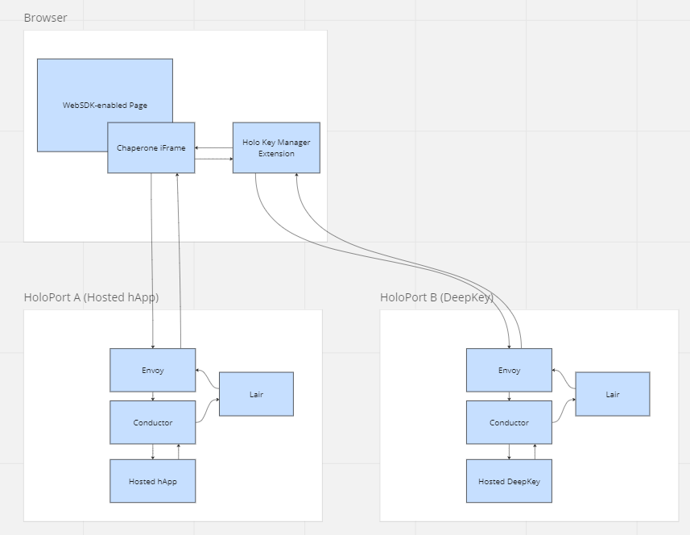
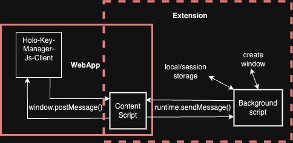

# Holo Key Manager


## Description

Holo Key Manager is a browser extension for generating and managing Holochain application keys, and using them with applications hosted on the Holo Network. Users install the extension and perform a one-time setup. They can then use a "passwordless" sign up and log in with compatible applications. Non-sensitive data is cloud-synced so that a user can maintain the same set of keys across multiple devices.

## Usage

A javascript client library is available at `@holo-host/holo-key-manager-js-client`. See client documentation [here](holo-key-manager-js-client/README.md)

## Architecture

Holo Key Manager is expected to be used for Holo-hosted applications in conjunction with the Chaperone connection manager. The diagram below provides context of how Holo Key Manager interfaces with the rest of the Holo Hosting stack. Note that Deepkey is not currently implemented and is currently substituted by a centralised store.



The diagram below depicts the architecture of the Holo Key Manager itself. It demonstrates the client's interaction with the extension and outlines the communication schema between the webapp and the extension API.



## Roadmap

The priority items are:

1. Replace the centralised Cloud Sync component with Deepkey
2. Implement features to interact with Deepkey for key revocation and rotation

## Development Setup

To set up the development environment for the Holo Key Manager monorepo, follow these steps:

### Prerequisites

Ensure you have the following installed on your machine:

- Node.js (v16 or higher)
- pnpm (v7 or higher)

Additionally, request the `.env` file from the codebase maintainer. Once you receive it, ensure that it matches the structure and keys provided in the `.env.example` file.

### Initial Setup

1. **Clone the repository:**

   ```sh
   git clone https://github.com/holo-host/holo-key-manager.git
   cd holo-key-manager
   ```

2. **Install dependencies:**
   ```sh
   pnpm install
   ```

### Building the Projects

The monorepo consists of two main projects: `holo-key-manager-extension` and `holo-key-manager-js-client`, and a shared directory. You can build these projects using the following commands:

1. **Build the extension:**

   ```sh
   pnpm buildExtension
   ```

2. **Build the client:**

   ```sh
   pnpm buildClient
   ```

3. **Build both projects for development:**
   ```sh
   pnpm build
   ```

### Loading Extension Files into Chrome Browser

After building the extension, you need to load it into your Chrome browser to test and use it. Follow these steps:

1. **Open Chrome and navigate to the Extensions page:**

   Open Chrome and go to `chrome://extensions/` or click on the three dots in the upper right corner, then go to `More tools` > `Extensions`.

2. **Enable Developer Mode:**

   In the top right corner of the Extensions page, toggle the switch to enable Developer Mode.

3. **Load the unpacked extension:**

   Click on the "Load unpacked" button that appears after enabling Developer Mode. This will open a file dialog.

4. **Select the build folder:**

   Navigate to the `holo-key-manager-extension/build` directory in your file system and select it. This will load the extension into Chrome.

5. **Verify the extension is loaded:**

   You should see the Holo Key Manager extension listed on the Extensions page. Ensure there are no errors and the extension is enabled.

By following these steps, you can load and test the Holo Key Manager extension in your Chrome browser. If you encounter any issues, check the console for error messages and ensure that the build process completed successfully.

### Working with holo-key-manager-js-client

If you want to work on the interaction between the extension and the client, you need to run the `buildPack` script inside the `holo-key-manager-js-client` directory. This will create a `.tgz` file that you can link to your new web app.

1. **Build the client package:**

   ```sh
   cd holo-key-manager-js-client
   pnpm buildPack
   ```

2. **Create a new web app:**

   You can use any framework of your choice. Here are examples for Create React App and a new Svelte project.

   **Create React App:**

   ```sh
   npx create-react-app my-holo-app
   cd my-holo-app
   ```

   **New Svelte Project:**

   ```sh
   npx degit sveltejs/template my-holo-app
   cd my-holo-app
   pnpm install
   ```

3. **Link the `.tgz` file:**

   After building the client package, link the generated `.tgz` file to your new web app.

   ```sh
   pnpm add ../holo-key-manager-js-client/holo-key-manager-js-client-1.0.0.tgz
   ```

4. **Call API functions:**

   You can now call the API functions defined in the `README` of `holo-key-manager-js-client`. Here is an example of how to use the API in your new web app.

By following these steps, you can set up a new web app and interact with the Holo Key Manager extension using the `holo-key-manager-js-client` API.

### Linting and Formatting

To ensure code quality and consistency, use the following commands:

1. **Lint the code:**

   ```sh
   pnpm lint
   ```

2. **Format the code:**

   ```sh
   pnpm format
   ```

3. **Run linting and formatting together:**
   ```sh
   pnpm lintAndFormat
   ```

### Project Structure

- **holo-key-manager-js-client:** Contains the JavaScript client library for managing Holo keys.
- **holo-key-manager-extension:** Contains the browser extension for managing Holo keys.

### Workspaces

The monorepo uses pnpm workspaces to manage dependencies and scripts across multiple projects. The workspaces are defined in the root `package.json`:

By following these steps, you should be able to set up and start developing on the Holo Key Manager monorepo. If you encounter any issues or have questions, feel free to reach out to the maintainers.

## Testing

## License

MIT License

Permission is hereby granted, free of charge, to any person obtaining a copy
of this software and associated documentation files (the "Software"), to deal
in the Software without restriction, including without limitation the rights
to use, copy, modify, merge, publish, distribute, sublicense, and/or sell
copies of the Software, and to permit persons to whom the Software is
furnished to do so, subject to the following conditions:

The above copyright notice and this permission notice shall be included in all
copies or substantial portions of the Software.

THE SOFTWARE IS PROVIDED "AS IS", WITHOUT WARRANTY OF ANY KIND, EXPRESS OR
IMPLIED, INCLUDING BUT NOT LIMITED TO THE WARRANTIES OF MERCHANTABILITY,
FITNESS FOR A PARTICULAR PURPOSE AND NONINFRINGEMENT. IN NO EVENT SHALL THE
AUTHORS OR COPYRIGHT HOLDERS BE LIABLE FOR ANY CLAIM, DAMAGES OR OTHER
LIABILITY, WHETHER IN AN ACTION OF CONTRACT, TORT OR OTHERWISE, ARISING FROM,
OUT OF OR IN CONNECTION WITH THE SOFTWARE OR THE USE OR OTHER DEALINGS IN THE
SOFTWARE.

## Contact

For any questions or support, please contact:

- [@mrruby](https://github.com/mrruby)
- [@alastairong](https://github.com/alastairong)

Feel free to reach out with any questions or suggestions.
